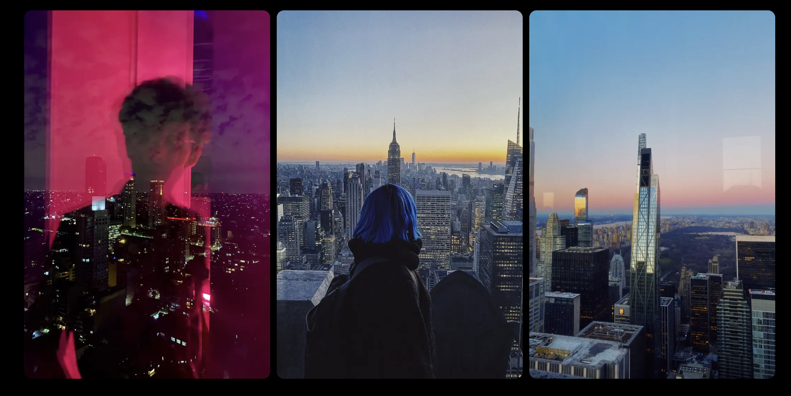
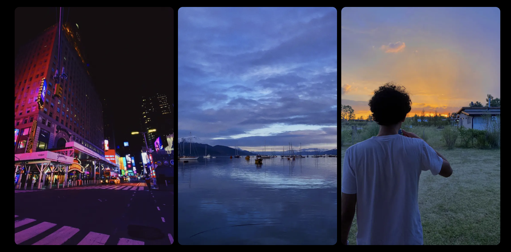
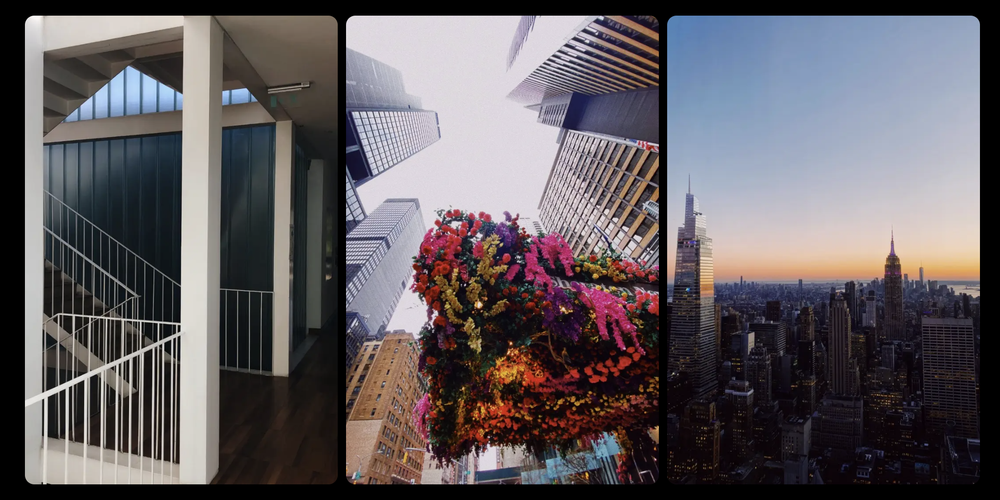

## # Spooky Gallery – Photography Portfolio

Un portfolio simple para mostrar una colección fotográfica con estilo. Este proyecto está hecho en **Next.js** y utiliza imágenes locales para una carga rápida y control total sobre el diseño.

---

## Vercel: (https://spooky-gallery2.vercel.app/)

## ✨ Características
* Desarrollado con **Next.js** 
* Diseño responsive y minimalista
* Galería de imágenes con `next/image` optimizada
* Código limpio y fácil de modificar

---

## 🚀 Instalación y uso
1. Clonar el repositorio:
```bash
git clone https://github.com/spookycoincidence/spooky-gallery
```
2. Instalar dependencias:
```bash
cd spooky-gallery
npm install
```
3. Correr la app en modo desarrollo:
```bash
npm run dev
```
4. Abrir http://localhost:3000 en el navegador


## 📸 Screenshots
---


  

---

  

---

  

---

## 🖼️ Agregar nuevas fotos
* Colocá tus imágenes en la carpeta:

```bash
public/photos/photos/
```

* Luego agregalas al array photos en pages/index.tsx

```bash
const photos = [
  '/photos/photos/photo1.png',
  '/photos/photos/photo2.png',
  // agregá aquí tus nuevas imágenes
]
```

## Tecnologías
* ⚛️ Next.js 
* 🧠 React 
* 💜 CSS Modules

## Desarrollado con ❤️ por spookycoincidence
